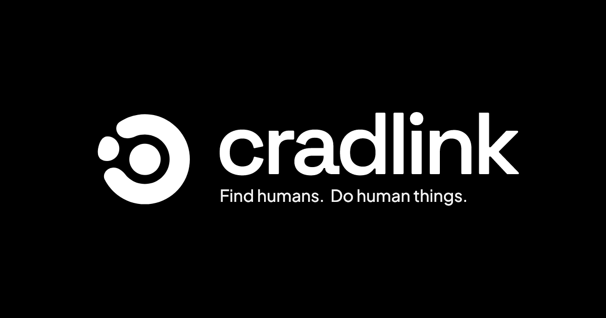

<div align="center">
  

  <br />

  **A social activity platform for turning online discovery into real plans.**

  <br />

  `Web` &nbsp; `iOS` &nbsp; `Android` &nbsp; `Firebase`

  <br />

  [Get started](#get-started) · [Explore the product](#the-product) · [Configure Firebase](#firebase) · [Deploy](#deployment)
</div>

---

## The product

Cradlink helps people find an activity, join the right group, and show up. Users can publish plans, discover people nearby, manage attendance, talk before the event, and keep their public activity history in one place.

The repository contains two clients for the same product:

| | Web | Mobile |
| --- | --- | --- |
| **Location** | [`web/`](./web) | [`mobile/`](./mobile) |
| **Runtime** | Browser | Android and iOS |
| **Framework** | Vite + React | Expo + React Native |
| **Routing** | React Router | Expo Router |
| **Styling** | Tailwind CSS | React Native styles |
| **Data** | Local browser mode or Firebase | Firebase |

Both apps use the same Firebase project and follow the same domain model.

### What you can do

| Discover | Organize | Connect |
| --- | --- | --- |
| Browse and filter activities | Publish and edit an activity | Follow public or private profiles |
| Search for people | Add up to six photos | Handle follow and join requests |
| View public profiles | Set time, place and capacity | Join threaded discussions |
| See active and past plans | Choose automatic or manual joining | Receive activity notifications |

Other product details include email verification, Google sign-in, account reactivation, multilingual UI, activity reminders, member management, and responsive navigation.

<br />

<div align="center">
  
  &nbsp;
  
  &nbsp;
  
</div>

---

## Get started

### Prerequisites

- Node.js 22
- npm
- Expo Go or a native simulator for mobile development
- A Firebase project when running the production backend

### Run the web app

```bash
cd web
npm install
npm run dev
```

Visit [localhost:3000](http://localhost:3000). The default configuration uses a browser-local backend, so the web app can be explored without Firebase credentials.

```bash
npm run lint      # lint the web project
npm run build     # type-check and build for production
npm run preview   # preview the production build
```

### Run the mobile app

```bash
cd mobile
npm install
npm start
```

Use the Expo terminal to open Android, iOS, or React Native Web.

```bash
npm run android
npm run ios
npm run web
npx tsc --noEmit
```

---

## Firebase

Cradlink uses Firebase Authentication, Cloud Firestore, and Firebase Storage. Rules and indexes are shared by both clients and live at the repository root.

### 1. Create the services

In Firebase Console:

1. Enable Email/Password and Google authentication.
2. Create a Cloud Firestore database.
3. Enable Firebase Storage.
4. Register a web app and copy its configuration.

Deploy the repository rules and indexes with Firebase CLI:

```bash
firebase deploy --only firestore:rules,firestore:indexes,storage
```

### 2. Configure web

```bash
cp web/.env.example web/.env.local
```

```dotenv
VITE_BACKEND=firebase
VITE_FIREBASE_API_KEY=
VITE_FIREBASE_AUTH_DOMAIN=
VITE_FIREBASE_PROJECT_ID=
VITE_FIREBASE_STORAGE_BUCKET=
VITE_FIREBASE_MESSAGING_SENDER_ID=
VITE_FIREBASE_APP_ID=
```

Use `VITE_BACKEND=local` when Firebase is not needed.

### 3. Configure mobile

```bash
cp mobile/.env.example mobile/.env
```

```dotenv
EXPO_PUBLIC_BACKEND=firebase
EXPO_PUBLIC_FIREBASE_API_KEY=
EXPO_PUBLIC_FIREBASE_AUTH_DOMAIN=
EXPO_PUBLIC_FIREBASE_PROJECT_ID=
EXPO_PUBLIC_FIREBASE_STORAGE_BUCKET=
EXPO_PUBLIC_FIREBASE_MESSAGING_SENDER_ID=
EXPO_PUBLIC_FIREBASE_APP_ID=

EXPO_PUBLIC_GOOGLE_WEB_CLIENT_ID=
EXPO_PUBLIC_GOOGLE_ANDROID_CLIENT_ID=
EXPO_PUBLIC_GOOGLE_IOS_CLIENT_ID=
EXPO_PUBLIC_EXPO_PROJECT=@ljubogdan/cradlink
```

Never commit populated environment files.

---

## Repository map

```text
cradlink/
├── web/
│   ├── public/              static assets
│   └── src/
│       ├── components/      feature and UI components
│       ├── hooks/           client state and queries
│       ├── layouts/         application shells
│       ├── lib/             domain and backend code
│       └── pages/           route-level screens
│
├── mobile/
│   ├── app/                 Expo Router screens
│   ├── assets/              native images and fonts
│   ├── components/          React Native UI
│   ├── hooks/               providers and client state
│   └── lib/                 domain and backend code
│
├── firebase.json
├── firestore.indexes.json
├── firestore.rules
├── storage.rules
└── vercel.json
```

When the product model changes, keep [`web/src/lib/types.ts`](./web/src/lib/types.ts) and [`mobile/lib/types.ts`](./mobile/lib/types.ts) aligned.

---

## Deployment

### Web · Vercel

The root [`vercel.json`](./vercel.json) builds `web/`, publishes `web/dist`, and configures SPA routing. Leave the Vercel **Root Directory** empty.

| Branch | Suggested environment |
| --- | --- |
| `main` | Production |
| `development` | Staging |

Set `VITE_BACKEND=firebase` and all `VITE_FIREBASE_*` variables in Vercel. Add each deployed hostname to Firebase Authentication authorized domains and to the Google OAuth authorized origins.

### Mobile · EAS

```bash
cd mobile
npx eas build --platform android --profile preview
npx eas build --platform android --profile production
```

The `preview` profile creates an installable APK. The `production` profile creates an Android App Bundle for store distribution.

---

## Before merging

Run the checks for both applications:

```bash
cd web
npm run lint
npm run build

cd ../mobile
npx tsc --noEmit
```

Also verify Firebase rules whenever a data model or query changes.

---

<div align="center">
  

  **Find people. Do the thing.**

  <sub>CRADLINK · WEB + MOBILE</sub>
</div>
