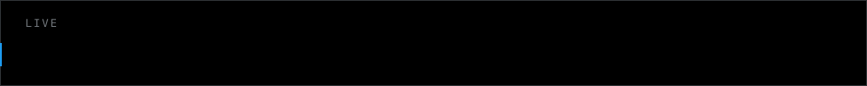
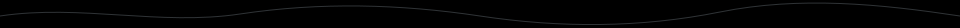
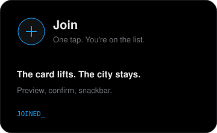
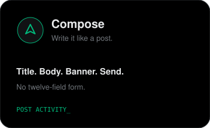
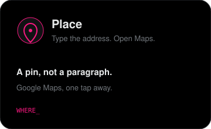

  

  

  

 

  <strong>The city is not a group chat.</strong> 
  Cradlink is the feed where a night actually happens. 
  You don’t apply. You show up.

 

  
  &nbsp;
  
  &nbsp;
  

 

---

### Now playing

A black screen. A card lifts off the feed like it was taken from a shelf.  
Blur. Confirm. **Joined.** A snackbar, not a parade.

Compose is a post, not a form.  
Banner for the type. Address or Maps.  
X to close. One button to send.

Lights out. Hairline borders. No chrome.

---

  <code>find people</code>
  &nbsp;·&nbsp;
  <code>do the thing</code>
  &nbsp;·&nbsp;
  <code>don’t lurk</code>

  CRADLINK MOBILE&nbsp;&nbsp;·&nbsp;&nbsp;BLACK / WHITE / BLUE&nbsp;&nbsp;·&nbsp;&nbsp;THE SIDEWALK APP

